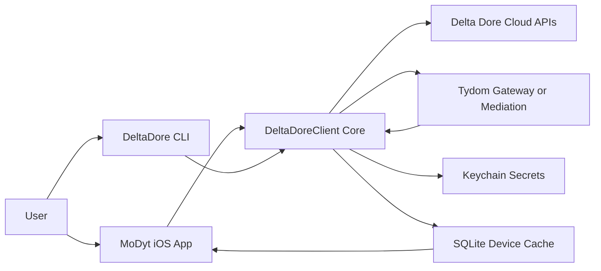

# MoDyt Threat Model

## Executive summary
MoDyt is a client-side iOS app plus a companion CLI that connects to Delta Dore cloud APIs and Tydom gateways over WebSocket+Digest auth. The highest-risk theme is transport trust: TLS certificate validation can be bypassed by default in gateway flows, which makes gateway impersonation and traffic tampering materially easier on hostile networks. Secondary risks are abuse of gateway-controlled polling metadata (availability drain), CLI credential handling (`--cloud-password`/raw payload dumps), and unbounded inbound message processing that can degrade app responsiveness and battery.

## Scope and assumptions
- In-scope paths:
  - `MoDyt/App`
  - `Packages/DeltaDoreClient/Sources/DeltaDoreClient`
  - `Packages/DeltaDoreClient/Sources/DeltaDoreCLI`
  - `Packages/Persistence/Sources/Persistence`
- Out-of-scope:
  - Tests (`MoDyt/MoDytTests`, `Packages/*/Tests`)
  - Xcode project metadata/build artifacts (`MoDyt.xcodeproj`, `.codex`, `.git`)
  - CI/release pipelines (none discovered in-repo)
- Assumptions used for this model:
  - Production iOS builds run without `DEBUG` logging paths (`MoDyt/App/AppEnvironment.swift:18`).
  - The app is single-user consumer usage, not multi-tenant SaaS.
  - No server component in this repo is internet-listening; this repo is a client and local data store.
  - Threats assume realistic adversaries: LAN attacker, compromised gateway/cloud account, or local user with CLI/process access.
  - Tydom gateway password strength is unknown; weak passwords increase offline cracking risk.
- Open questions that could materially change ranking:
  - Is `allowInsecureTLS` intentionally required in production environments?
  - Is `DeltaDoreCLI` shipped to end users or only internal/support tooling?
  - Are home occupancy/device metadata treated as sensitive personal data under your policy?

## System model
### Primary components
- iOS app runtime (`MoDytApp`) instantiates `AppEnvironment` and feature stores (`MoDyt/App/MoDytApp.swift:3`, `MoDyt/App/AppEnvironment.swift:15`).
- Authentication/UI entry gathers cloud credentials and site selection (`MoDyt/App/Features/Authentication/Views/LoginView.swift:34`, `MoDyt/App/Factories/AuthenticationStoreFactory.swift:17`).
- `DeltaDoreClient` orchestrates stored/new credential flows, local discovery, local/remote connection, and session state (`Packages/DeltaDoreClient/Sources/DeltaDoreClient/DeltaDoreClient.swift:12`, `Packages/DeltaDoreClient/Sources/DeltaDoreClient/TydomConnection/Resolver/TydomConnectionResolver.swift:156`).
- Connection stack uses `wss://<host>:443/mediation/client?...` with HTTP Digest auth (`Packages/DeltaDoreClient/Sources/DeltaDoreClient/TydomConnection/Core/TydomConnection+Configuration.swift:97`, `Packages/DeltaDoreClient/Sources/DeltaDoreClient/TydomConnection/Core/TydomDigest.swift:43`).
- Local discovery probes subnet hosts and optionally `/info` WebSocket validation (`Packages/DeltaDoreClient/Sources/DeltaDoreClient/TydomConnection/Discovery/TydomGatewayDiscovery.swift:83`, `Packages/DeltaDoreClient/Sources/DeltaDoreClient/Live/TydomGatewayDiscovery+Live.swift:87`).
- Inbound gateway frames are parsed/decoded, may schedule polling effects, and are persisted into SQLite-backed repositories (`Packages/DeltaDoreClient/Sources/DeltaDoreClient/TydomMessages/TydomMessageDecoder.swift:54`, `MoDyt/App/Datasources/DeviceRepository.swift:208`).
- Secrets are stored in Keychain stores (cloud creds, gateway creds, gateway MAC) (`Packages/DeltaDoreClient/Sources/DeltaDoreClient/Live/TydomCloudCredentialStore+Keychain.swift:6`, `Packages/DeltaDoreClient/Sources/DeltaDoreClient/Live/TydomGatewayCredentialStore+Keychain.swift:6`).
- CLI entrypoint supports interactive command sending and raw site payload output (`Packages/DeltaDoreClient/Sources/DeltaDoreCLI/DeltaDoreCLIEntry.swift:4`, `Packages/DeltaDoreClient/Sources/DeltaDoreCLI/CLIConnection.swift:268`).

### Data flows and trust boundaries
- User -> iOS Login UI -> DeltaDoreClient auth flow
  - Data: cloud email/password, selected site index.
  - Channel: local process memory/UI bindings.
  - Security guarantees: none beyond OS process sandbox; no local credential validation beyond non-empty checks.
  - Validation/enforcement: `canLoadSites` requires non-empty fields; site index chosen from fetched list (`MoDyt/App/Features/Authentication/Stores/AuthenticationStore.swift:12`).
- iOS/CLI client -> Delta Dore cloud APIs
  - Data: cloud credentials -> OAuth token exchange -> bearer token -> site list/gateway password.
  - Channel: HTTPS via `URLSession`.
  - Security guarantees: platform TLS default handling for cloud requests.
  - Validation/enforcement: response status checks + JSON decoding (`Packages/DeltaDoreClient/Sources/DeltaDoreClient/TydomConnection/Cloud/TydomCloudPasswordProvider.swift:74`, `Packages/DeltaDoreClient/Sources/DeltaDoreClient/TydomConnection/Cloud/TydomCloudSitesProvider.swift:63`).
- Client -> local network hosts during discovery
  - Data: gateway MAC/password used in probe handshake, probe traffic to subnet hosts.
  - Channel: TCP probes + WebSocket probe over TLS.
  - Security guarantees: optional `/info` validation by MAC; can fall back to unvalidated candidates.
  - Validation/enforcement: scan for responsive ports, optional MAC match in `/info` (`Packages/DeltaDoreClient/Sources/DeltaDoreClient/TydomConnection/Discovery/TydomGatewayDiscovery.swift:108`, `Packages/DeltaDoreClient/Sources/DeltaDoreClient/TydomConnection/Discovery/TydomGatewayInfoValidator.swift:4`).
- Client -> Tydom gateway/mediation WebSocket
  - Data: digest authorization headers, control commands, telemetry frames.
  - Channel: WSS on 443.
  - Security guarantees: HTTP Digest authentication; TLS server trust may be bypassed when insecure mode is enabled/defaulted.
  - Validation/enforcement: no certificate pinning; `allowInsecureTLS` defaults true in config path when unset (`Packages/DeltaDoreClient/Sources/DeltaDoreClient/TydomConnection/Core/TydomConnection+Configuration.swift:61`).
- Gateway frames -> parser/decoder -> effect scheduler -> SQLite repositories
  - Data: device metadata/state/cdata, derived polling URLs, device records.
  - Channel: in-process parsing and actor pipelines.
  - Security guarantees: schema decode attempts and typed modeling; no explicit message size/rate limits.
  - Validation/enforcement: decode guards (`try?`/typed structs), but URLs from cmeta are directly constructed/scheduled (`Packages/DeltaDoreClient/Sources/DeltaDoreClient/TydomMessages/TydomMessageDecoder.swift:345`, `Packages/DeltaDoreClient/Sources/DeltaDoreClient/TydomMessages/TydomMessagePollScheduler.swift:35`).
- Client secrets/data at rest
  - Data: keychain credentials; SQLite device/shutter data in app support.
  - Channel: local OS storage.
  - Security guarantees: Keychain API and app sandbox.
  - Validation/enforcement: credentials cleared on disconnect/remote failure (`Packages/DeltaDoreClient/Sources/DeltaDoreClient/TydomConnection/Resolver/TydomConnectionResolver.swift:147`).

#### Diagram

## Assets and security objectives
| Asset | Why it matters | Security objective (C/I/A) |
|---|---|---|
| Cloud credentials (email/password) | Account takeover unlocks site list and gateway password fetch. | C, I |
| Gateway password + MAC mapping | Grants control channel access to smart-home devices. | C, I |
| Active control commands (shutter/light/firmware/API mode) | Integrity failure can alter physical home state. | I, A |
| Device telemetry/state history in SQLite | Can reveal occupancy and behavior patterns; drives UI decisions. | C, I |
| Keychain credential store | Compromise enables durable replay across sessions. | C |
| Poll scheduler/task set | Abuse can drain battery/network and degrade service availability. | A |
| Connection decision state (local vs remote) | Wrong trust decision can route to attacker-controlled endpoint. | I, A |

## Attacker model
### Capabilities
- LAN-adjacent attacker can run rogue host, ARP spoof, or intercept local traffic during discovery/connection attempts.
- Remote network attacker can tamper with traffic where TLS validation is disabled or downgraded in client behavior.
- Compromised/impersonated gateway can send arbitrary protocol frames (`/devices/*`, `/cmeta`, `/events`) to parser/effect pipeline.
- Local user/process with host access (macOS CLI use-case) can inspect process arguments, terminal history, or captured stdout/stderr.

### Non-capabilities
- This repo does not expose an internet-facing server endpoint to unauthenticated external clients.
- Pure remote attacker without network position cannot directly read iOS Keychain contents.
- No dynamic code evaluation surface discovered in runtime path; memory-corruption classes are less likely in Swift-layer code.

## Entry points and attack surfaces
| Surface | How reached | Trust boundary | Notes | Evidence (repo path / symbol) |
|---|---|---|---|---|
| iOS login fields | App UI input | User -> App | Collects cloud credentials and starts auth flow. | `MoDyt/App/Features/Authentication/Views/LoginView.swift:34` |
| CLI args (`--cloud-password`) | Command line | Local user/process -> CLI | Secrets appear in argv/process-history contexts. | `Packages/DeltaDoreClient/Sources/DeltaDoreCLI/CLIParsing.swift:31` |
| CLI raw sites dump | CLI option | Cloud response -> local stdout | Potentially sensitive site payload emitted directly. | `Packages/DeltaDoreClient/Sources/DeltaDoreCLI/CLIConnection.swift:276` |
| CLI raw request command | Interactive stdin | Local user -> gateway command channel | Arbitrary request text can be forwarded. | `Packages/DeltaDoreClient/Sources/DeltaDoreCLI/CLIInteractive.swift:14` |
| Cloud OAuth/token/password APIs | HTTPS requests | Client -> Internet | Auth + gateway secret retrieval. | `Packages/DeltaDoreClient/Sources/DeltaDoreClient/TydomConnection/Cloud/TydomCloudPasswordProvider.swift:6` |
| Local subnet discovery scan | Auto discovery | Client -> LAN hosts | Probes many hosts, then attempts connection. | `Packages/DeltaDoreClient/Sources/DeltaDoreClient/TydomConnection/Discovery/TydomGatewayDiscovery.swift:108` |
| Gateway WebSocket connect | Resolver/connect flow | Client -> gateway/mediation | Digest auth + long-lived control session. | `Packages/DeltaDoreClient/Sources/DeltaDoreClient/TydomConnection/Core/TydomConnection.swift:132` |
| TLS trust delegate | URLSession/NW TLS callbacks | Remote endpoint cert -> client trust | Accepts server trust when insecure mode true. | `Packages/DeltaDoreClient/Sources/DeltaDoreClient/TydomConnection/Core/InsecureTLSDelegate.swift:29` |
| Inbound frame parsing/decoding | WebSocket receive loop | Gateway payload -> app logic | Message bodies influence cache and effects. | `Packages/DeltaDoreClient/Sources/DeltaDoreClient/TydomMessages/TydomHTTPFrame.swift:75` |
| Poll scheduling from cmeta | Decoder effect output | Payload metadata -> autonomous requests | URLs derived from payload enum values, no cap. | `Packages/DeltaDoreClient/Sources/DeltaDoreClient/TydomMessages/TydomMessageDecoder.swift:345` |
| Local persistence store | Repository writes | App runtime -> filesystem | Device state persisted in app support SQLite DB. | `MoDyt/App/AppEnvironment.swift:121`, `MoDyt/App/Datasources/DeviceRepository.swift:275` |
| Keychain credential stores | Resolver/Live deps | Runtime secrets -> OS keychain | Stores cloud and gateway credentials across sessions. | `Packages/DeltaDoreClient/Sources/DeltaDoreClient/Live/TydomCloudCredentialStore+Keychain.swift:12` |

## Top abuse paths
1. Gateway impersonation on LAN:
   - Attacker hosts a rogue endpoint on local subnet and responds on port 443.
   - Discovery selects a responsive candidate; TLS trust is accepted in insecure mode.
   - Client sends digest-authenticated traffic and processes attacker frames.
   - Impact: command/telemetry integrity compromise and potential credential capture.
2. MitM command tampering:
   - Attacker gains network position between client and gateway/mediation.
   - Because insecure TLS trust bypass is enabled, forged cert is accepted.
   - Attacker modifies outbound control commands or inbound state.
   - Impact: unauthorized device actions and false operational state in UI.
3. Poll-task exhaustion from malicious cmeta:
   - Compromised gateway emits cmeta with many enum values.
   - Decoder builds many polling URLs and schedules recurring tasks.
   - Poll scheduler continuously sends requests with no hard cap.
   - Impact: battery/network drain and degraded responsiveness.
4. CLI credential leakage:
   - User passes `--cloud-password` in shell invocation.
   - Local attacker reads process args/history or recorded terminal session.
   - Stolen creds used to fetch token/sites/gateway password.
   - Impact: account and gateway takeover.
5. Oversized message DoS:
   - Malicious gateway streams high-volume or oversized payloads.
   - Parser/decoder allocates and processes full frame bodies.
   - Repository upserts and notifies observers repeatedly.
   - Impact: memory/CPU pressure, storage churn, app instability.
6. Malformed JSON/body injection in command builder:
   - Attacker-controlled strings (CLI/user provided values) include quote/control chars.
   - Command body/path is composed via interpolation, not structured encoding.
   - Gateway may parse unintended fields or reject malformed commands.
   - Impact: integrity drift or unintended command semantics.

## Threat model table
| Threat ID | Threat source | Prerequisites | Threat action | Impact | Impacted assets | Existing controls (evidence) | Gaps | Recommended mitigations | Detection ideas | Likelihood | Impact severity | Priority |
|---|---|---|---|---|---|---|---|---|---|---|---|---|
| TM-001 | LAN MitM / rogue gateway | Attacker can intercept LAN traffic or present a fake endpoint during local discovery. | Abuse insecure TLS trust path to impersonate gateway/mediation and tamper with bidirectional traffic. | Unauthorized device control, false telemetry, session compromise. | Gateway password usage, command integrity, telemetry integrity. | Digest auth challenge/response and optional `/info` MAC validation (`.../TydomDigest.swift:43`, `.../TydomGatewayInfoValidator.swift:4`). | TLS server trust bypass is enabled by default when unset (`.../TydomConnection+Configuration.swift:61`, `.../InsecureTLSDelegate.swift:29`, `.../TydomConnection.swift:421`). | Default `allowInsecureTLS=false`; require explicit debug-only opt-in; add certificate pinning/CA pinning for known hosts; fail closed on TLS validation errors. | Alert on certificate/public-key changes, sudden host changes for known MAC, repeated local connect failures then remote success. | high | high | high |
| TM-002 | Compromised gateway or attacker controlling inbound frames | Attacker controls gateway responses (via compromise or TM-001). | Send crafted `/devices/cmeta` payloads that expand to many polling URLs and trigger perpetual polling tasks. | Availability degradation, battery drain, network exhaustion. | Poll scheduler availability budget, device battery/network resources. | Deduplicates exact `(url, interval)` entries (`.../TydomMessagePollScheduler.swift:38`). | No upper bound, TTL, or strict URL allowlist for scheduled polls (`.../TydomMessageDecoder.swift:345`, `.../TydomMessagePollScheduler.swift:35`). | Cap total scheduled URLs per session/device; enforce strict URL schema + query allowlist; add expiry and backoff; cancel stale poll tasks when metadata changes. | Emit metrics: `scheduled_poll_task_count`, poll request rate, and drop events for capped tasks. | high | medium | high |
| TM-003 | Local attacker on CLI host | User runs CLI with sensitive args or raw dumps in shared/observed environment. | Read `--cloud-password` from argv/history or capture raw site payload output from `--dump-sites-response`. | Cloud account takeover leading to gateway secret retrieval and control. | Cloud credentials, gateway password, site metadata. | Credentials can be persisted in Keychain for runtime flows (`.../TydomCloudCredentialStore+Keychain.swift:12`). | CLI still accepts password on command line and emits raw payloads (`.../CLIParsing.swift:31`, `.../CLIConnection.swift:276`). | Replace password arg with secure prompt/stdin/env-token flow; redact sensitive fields in dump output; add warnings and safe-by-default behavior. | Warn/telemetry when insecure flags used (`--cloud-password`, `--dump-sites-response`), shell integration docs. | medium | high | high |
| TM-004 | Malicious or noisy upstream endpoint | Attacker can stream large/frequent frames over existing connection. | Flood message parser/decoder and repository write path to force repeated heavy processing. | App slowdown/crash, high resource use, stale or unusable UI. | App availability, local storage, UX reliability. | Actor isolation and typed decode reduce race/corruption risk (`.../TydomConnection.swift:218`, `.../DeviceRepository.swift:5`). | No explicit max frame size, decode budget, or ingestion rate limit (`.../TydomHTTPFrame.swift:75`, `.../TydomMessageDecoder.swift:133`, `.../DeviceRepository.swift:120`). | Add max frame/body size checks pre-parse; rate-limit device updates; bound cache sizes; drop/trace oversized payloads; throttle observer notifications. | Track message byte rate, parse failures, and DB upsert churn; alert on sustained spikes. | medium | medium | medium |
| TM-005 | Input-manipulating user/script (CLI or UI-mediated values) | Attacker can feed quote/control characters into command fields or URLs. | Exploit string-interpolated JSON/path composition to alter command semantics or send malformed protocol payloads. | Unintended state change or command rejection loops. | Command integrity, device state consistency. | Some values originate from typed enums/ints; SQLite uses bound params for DB safety (`.../SQLiteDatabase.swift:78`). | Command bodies/paths are built via interpolation without JSON/path escaping (`.../TydomCommand.swift:250`). | Build bodies via `JSONEncoder` structs; percent-encode query/path components; validate allowed characters for command names/IDs. | Count command serialization failures and gateway parse errors; quarantine malformed command submissions. | medium | medium | medium |
| TM-006 | Credential-harvesting attacker leveraging weak local-trust flow | Attacker can induce local connection attempts to attacker-controlled host and capture digest handshakes. | Capture MD5 digest auth exchanges and attempt offline cracking of weak gateway passwords. | Gateway credential disclosure and persistent unauthorized control. | Gateway password confidentiality, command integrity. | Digest nonce/cnonce flow exists (`.../TydomDigest.swift:43`). | MD5 digest is legacy; local candidate fallback can proceed after failed validation path (`.../TydomDigest.swift:103`, `.../TydomGatewayDiscovery.swift:133`). | Prefer remote trusted endpoint when local validation fails; enforce strong password policy checks; consider stronger auth channel where protocol permits. | Detect repeated local challenge failures/unusual local hosts and sudden credential reset events. | medium | medium | medium |

## Criticality calibration
- `critical`
  - Definition for this repo: reliable exploitation leading to broad, pre-auth takeover across many users/devices with minimal attacker prerequisites.
  - Example scenarios: pre-auth remote code execution in client parser; universal auth bypass in cloud credential fetch; cross-account key leakage at scale.
- `high`
  - Definition for this repo: practical attacks causing unauthorized home control or credential theft with realistic attacker position.
  - Examples: TLS trust bypass enabling MitM command tampering (TM-001); CLI credential leakage enabling gateway takeover (TM-003); poll abuse creating sustained service degradation (TM-002).
- `medium`
  - Definition for this repo: attacks requiring stronger preconditions or resulting primarily in localized availability/integrity degradation.
  - Examples: message flood DoS via hostile upstream (TM-004); command serialization injection causing malformed actions (TM-005); offline cracking workflow contingent on weak secrets (TM-006).
- `low`
  - Definition for this repo: limited-impact issues requiring unlikely preconditions or mostly informational leakage.
  - Examples: debug-only log verbosity in non-production builds; minor metadata exposure without control impact; low-amplitude polling noise with easy throttling.

## Focus paths for security review
| Path | Why it matters | Related Threat IDs |
|---|---|---|
| `Packages/DeltaDoreClient/Sources/DeltaDoreClient/TydomConnection/Core/TydomConnection+Configuration.swift` | Defaulting `allowInsecureTLS` shapes transport trust posture globally. | TM-001, TM-006 |
| `Packages/DeltaDoreClient/Sources/DeltaDoreClient/TydomConnection/Core/InsecureTLSDelegate.swift` | Central cert-challenge handling can permit trust bypass. | TM-001 |
| `Packages/DeltaDoreClient/Sources/DeltaDoreClient/TydomConnection/Core/TydomConnection.swift` | Connection setup, receive loop, and TLS options are core attack choke points. | TM-001, TM-004 |
| `Packages/DeltaDoreClient/Sources/DeltaDoreClient/Live/TydomConnection+Dependencies+Live.swift` | Live session creation applies insecure TLS flag behavior. | TM-001 |
| `Packages/DeltaDoreClient/Sources/DeltaDoreClient/TydomConnection/Discovery/TydomGatewayDiscovery.swift` | Discovery fallback and candidate validation logic controls local trust boundary. | TM-001, TM-006 |
| `Packages/DeltaDoreClient/Sources/DeltaDoreClient/Live/TydomGatewayDiscovery+Live.swift` | Subnet probing and probe auth handshake behavior affects spoofing/exposure. | TM-001, TM-006 |
| `Packages/DeltaDoreClient/Sources/DeltaDoreClient/TydomMessages/TydomMessageDecoder.swift` | Untrusted payload decoding and poll URL derivation are abuse entry points. | TM-002, TM-004 |
| `Packages/DeltaDoreClient/Sources/DeltaDoreClient/TydomMessages/TydomMessagePollScheduler.swift` | Recurring task scheduling has direct availability impact. | TM-002 |
| `Packages/DeltaDoreClient/Sources/DeltaDoreClient/TydomConnection/Commands/TydomCommand.swift` | Command body/path interpolation needs robust escaping/encoding. | TM-005 |
| `Packages/DeltaDoreClient/Sources/DeltaDoreCLI/CLIParsing.swift` | CLI argument handling includes sensitive credential inputs. | TM-003 |
| `Packages/DeltaDoreClient/Sources/DeltaDoreCLI/CLIConnection.swift` | Raw payload dump and command execution paths can leak secrets. | TM-003, TM-005 |
| `Packages/DeltaDoreClient/Sources/DeltaDoreClient/Live/TydomCloudCredentialStore+Keychain.swift` | Secret storage behavior and lifecycle at rest. | TM-003 |
| `Packages/DeltaDoreClient/Sources/DeltaDoreClient/TydomConnection/Resolver/TydomConnectionResolver.swift` | Credential persistence/clearing and decision logic influence blast radius. | TM-001, TM-003 |
| `MoDyt/App/AppEnvironment.swift` | Database path, logging policy, and disconnect cleanup in app runtime. | TM-004 |
| `MoDyt/App/Datasources/DeviceRepository.swift` | Inbound device updates to SQLite represent primary persistence ingestion path. | TM-004 |

## Quality check
- Entry points discovered in runtime and CLI paths are covered in the attack-surface table.
- Each trust boundary in the system model maps to at least one threat in TM-001 through TM-006.
- Runtime behavior was separated from test/build metadata; tests and project metadata were scoped out.
- No additional user clarifications were provided, so risk ratings remain assumption-based and explicitly conditional.
- Key assumptions and open questions are stated in `Scope and assumptions`.
