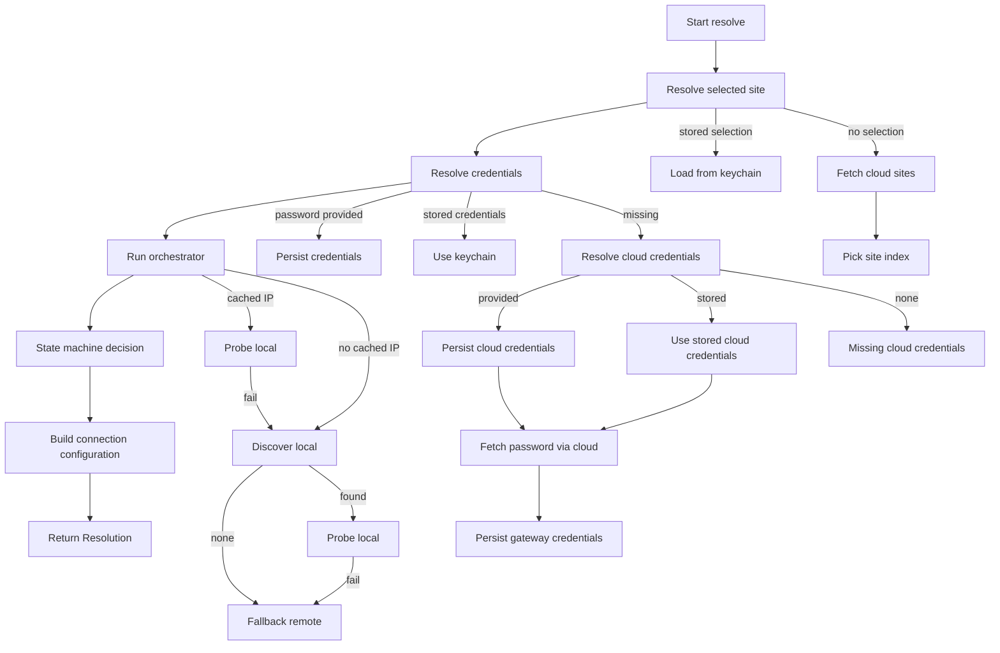
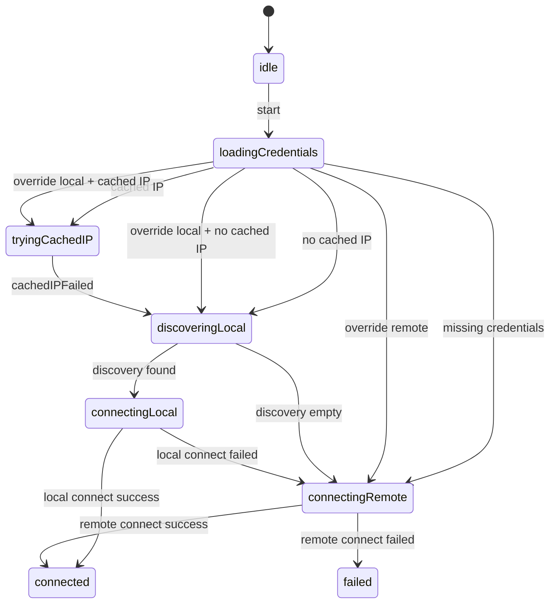

# Tydom connection process

This document explains the end-to-end connection flow, the default live wiring, and how to customize it.
It covers both the high-level API (`DeltaDoreClient`) and the internal resolver/state machine.

## Overview (layers)

1. **DeltaDoreClient** (public facade)  
   - Minimal API for apps/CLI: resolve, list sites, connect.
   - Wraps the resolver and builds a `TydomConnection`.

2. **TydomConnectionResolver** (decision engine)  
   - Resolves **site → MAC → credentials**, then **decides local vs remote**.
   - Runs the **orchestrator** (imperative shell) and **state machine** (pure core).

3. **TydomConnectionOrchestrator**  
   - Executes effects (discovery, probe, connect checks).
   - Feeds results back into the state machine.

4. **TydomConnectionStateMachine** (pure)  
   - Determines what to do next based on events (cached IP, discovery, failures).

5. **TydomConnection** (low-level WebSocket)  
   - Performs HTTP Digest authentication and reads/writes frames.

## Public entry points

### DeltaDoreClient (recommended)

```swift
let client = DeltaDoreClient.live()

let options = DeltaDoreClient.Options(
    mode: .auto,
    cloudCredentials: .init(email: "user@example.com", password: "secret")
)

let session = try await client.connect(
    options: options,
    selectSiteIndex: { sites in
        // Present a UI, return index
        return 0
    }
)

let connection = session.connection
```

### Resolver (advanced)

```swift
let resolver = TydomConnectionResolver()
let resolution = try await resolver.resolve(
    .init(mode: .auto, cloudCredentials: credentials),
    selectSiteIndex: { sites in 0 }
)

let connection = TydomConnection(
    configuration: resolution.configuration,
    onDisconnect: resolution.onDisconnect
)
```

## Live wiring (default)

The live implementation wires platform-safe defaults:

- **Credential store** → Keychain-backed (`TydomGatewayCredentialStore.liveKeychain`)
- **Selected site store** → Keychain-backed (`TydomSelectedSiteStore.liveKeychain`)
- **Cloud credentials store** → Keychain-backed (`TydomCloudCredentialStore.liveKeychain`)
- **Discovery** → `TydomGatewayDiscovery` (Bonjour + subnet probes)
- **Cloud** → `URLSession` for login/password fetch
- **Probe connection** → create `TydomConnection`, `connect()`, then `disconnect()`
- **Default remote host** → `mediation.tydom.com`
- **Default keychain services** → `io.sideeffect.deltadoreclient.*`

## Full connection flow

The resolution process is **always**:
1. **Resolve site selection** (find MAC).  
2. **Resolve credentials** (find or fetch password).  
3. **Run the orchestrator** to choose local/remote.  
4. **Build configuration** and return it to caller.  
5. Caller decides when to connect (e.g. `client.connect(...)`).

### 1) Site selection

Order of precedence:
- If `options.mac` is provided (and no explicit site selection is requested), it’s stored as a “manual” selection.
- Else, if a stored selection exists in `TydomSelectedSiteStore`, it’s reused.
- Else, fetch the cloud site list and:
  - use `options.siteIndex`, or
  - call `selectSiteIndex` (interactive), or
  - error if neither exists.

The selected site is persisted and reused on the next login unless reset.

### 2) Credentials

Using the selected site’s MAC:
- If `options.password` is provided, it is persisted and used immediately.
- Else, load from `TydomGatewayCredentialStore`.
- Else, use cloud credentials to fetch the gateway password, persist it, and return.

Cloud credentials resolution:
- If `options.cloudCredentials` is provided, it is persisted to the cloud credentials store.
- Else, if stored cloud credentials exist, they are reused automatically.
- On `disconnect()`, stored cloud credentials are cleared.

### 3) Connection decision (local vs remote)

The orchestrator runs the state machine and executes effects:
- Cached IP is tried first (if any).
- If cached IP fails → discovery (Bonjour + subnet probe).
- If discovery yields a host → probe local connection.
- If local fails → **fallback to remote (always)**.
- Override modes (force local/remote) bypass normal flow.

### 4) Final configuration

The resolver builds a `TydomConnection.Configuration` from:
- **Decision** (local/remote + host)
- **Credentials** (MAC + password)
- **Options** (TLS, timeout, polling, overrides)

## Mermaid diagrams

### Full resolution flow



### Internal state machine (simplified)



## Customization points

### Basic (via `Options`)

You can influence the flow without touching wiring:

- `mode`: `.auto | .local | .remote`
- `localHostOverride`, `remoteHostOverride`
- `mac`, `password`
- `cloudCredentials`
- `siteIndex`, `resetSelectedSite`
- `selectedSiteAccount`
- `allowInsecureTLS`
- `timeout`, `polling`
- `bonjourServices`
- `forceRemote`
- `onDecision` (callback)

### Advanced (custom Environment / Dependencies)

If you need deeper customization:

- Provide your own `TydomConnectionResolver.Environment`:
  - custom `credentialStore` (e.g. memory, SQL, secure enclave)
  - custom `selectedSiteStore`
  - custom discovery strategy
  - custom remote host
  - custom `makeSession` or `probeConnection`
- Or build a `DeltaDoreClient.Dependencies` to fully control:
  - resolution
  - list sites / raw payload
  - connection creation
  - connect behavior

## Notes

- The orchestrator uses **probe connections** (connect → disconnect) to decide local/remote.  
  The returned configuration is still used to create the real connection later.
- Disconnecting the final `TydomConnection` runs an optional `onDisconnect` effect that can reset the selected site when enabled.
- The functional core (state machine) remains pure and testable; side effects are injected via closures.
